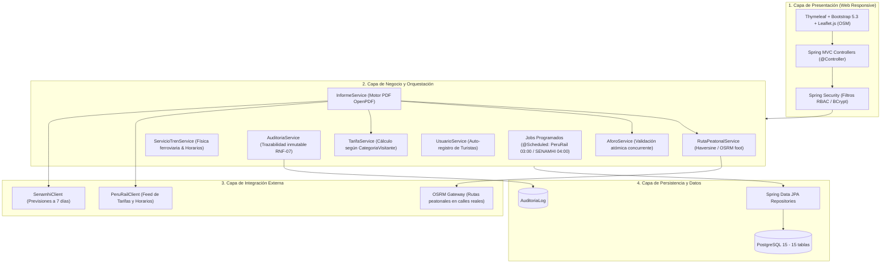

# 🚆 Asesor Turístico Ferroviario y Peatonal — MTC

[](https://www.oracle.com/java/)
[](https://spring.io/projects/spring-boot)
[](https://www.postgresql.org/)
[](https://leafletjs.com/)
[](https://www.docker.com/)
[](#-pruebas-y-aseguramiento-de-calidad)
[](#-pruebas-y-aseguramiento-de-calidad)
[](#-entorno-académico-e-institucional)

> **Plataforma web de planificación turística multimodal desarrollada para el Ministerio de Transportes y Comunicaciones (MTC) del Perú**, en convenio académico con la **Universidad Nacional de Ucayali (UNU)**.  
> Diseñada para articular el transporte ferroviario andino, senderos peatonales de acceso a atractivos turísticos, pronósticos meteorológicos oficiales en tiempo real y el control de aforos patrimoniales en áreas de alta afluencia.
> Diseñada para articular el transporte ferroviario andino, senderos peatonales de acceso a atractivos turísticos, pronósticos meteorológicos oficiales en tiempo real a 7 días y el control de aforos patrimoniales en áreas de alta afluencia.

---

## 📑 Tabla de Contenidos
1. [Propósito y Fin del Proyecto](#-propósito-y-fin-del-proyecto)
2. [Arquitectura del Sistema](#-arquitectura-del-sistema)
2. [Arquitectura del Sistema en 4 Capas](#-arquitectura-del-sistema-en-4-capas)
3. [Módulos y Actores del Sistema](#-módulos-y-actores-del-sistema)
4. [Reglas de Negocio Clave](#-reglas-de-negocio-clave)
5. [Pila Tecnológica](#-pila-tecnológica)
4. [Reglas de Negocio y Dominio Turístico](#-reglas-de-negocio-y-dominio-turístico)
5. [Pila Tecnológica Verificada](#-pila-tecnológica-verificada)
6. [Instalación y Despliegue](#-instalación-y-despliegue)
7. [Cuentas y Credenciales de Prueba](#-cuentas-y-credenciales-de-prueba)
8. [Pruebas y Aseguramiento de Calidad](#-pruebas-y-aseguramiento-de-calidad)
9. [Entorno Académico e Institucional](#-entorno-académico-e-institucional)
8. [Pruebas y Aseguramiento de Calidad (167 Tests)](#-pruebas-y-aseguramiento-de-calidad)
9. [Documentación Técnica Oficial (`docs/`)](#-documentación-técnica-oficial-docs)
10. [Entorno Académico e Institucional](#-entorno-académico-e-institucional)

---

## 🎯 Propósito y Fin del Proyecto

El turismo en la región andina del Perú (con epicentro en el corredor Cusco – Valle Sagrado – Machu Picchu – Puno – Arequipa) enfrenta un problema crónico de **dispersión informativa y falta de planificación integrada**:
El turismo en la región andina del Perú (corredores Cusco – Valle Sagrado – Machu Picchu – Puno – Arequipa) enfrenta un problema crónico de **dispersión informativa y falta de planificación integrada**:
- Los itinerarios de tren operan con horarios y tarifas desvinculados de los senderos peatonales locales.
- El clima en zonas de alta montaña y ceja de selva cambia de manera drástica, impactando la seguridad de las caminatas.
- Sitios arqueológicos vulnerables (como la *Llaqta de Machu Picchu*) cuentan con aforos estrictos regulados por el Estado que frecuentemente se agotan sin aviso previo al visitante.
- Los turistas de diferentes edades (infantes, niños, adultos) pagan tarifas proporcionales distintas en trenes frente a las entradas patrimoniales.

### 💡 Solución Desarrollada
El **Asesor Turístico Ferroviario y Peatonal** actúa como un concentrador inteligente que:
1. **Conecta de forma multimodal** los tramos de tren (PeruRail) con circuitos peatonales de ida y vuelta a la estación.
2. **Clasifica rutas según dificultad física** (Baja, Media, Alta) y valida la viabilidad física del circuito peatonal mediante un motor geográfico.
3. **Pronostica el clima** conectando con el servicio meteorológico nacional (**SENAMHI**) para la fecha exacta del viaje.
4. **Protege el aforo patrimonial** de las zonas reservadas mediante actualización atómica de cupos concurrentes.
2. **Clasifica rutas según dificultad física** (Baja, Media, Alta) y valida la viabilidad física del circuito peatonal mediante un motor geográfico con corte en 40 km.
3. **Pronostica el clima a 7 días** conectando con el servicio meteorológico nacional (**SENAMHI**) para la fecha exacta del viaje.
4. **Protege el aforo patrimonial** de las zonas reservadas mediante actualización atómica de cupos concurrentes (`ControlAforo`).
5. **Calcula presupuestos exactos por edad** y consolida un **itinerario oficial descargable en PDF o visualizable en HTML**.
6. **Ofrece historial y auto-registro** para turistas públicos sin depender de altas administrativas.

---

## 🏗 Arquitectura del Sistema
## 🏗 Arquitectura del Sistema en 4 Capas

El software implementa una **Arquitectura en 4 Capas**, desacoplada, escalable y guiada por el dominio:



---

## 👥 Módulos y Actores del Sistema

El sistema implementa **Control de Acceso Basado en Roles (RBAC)** con 4 perfiles diferenciados:
El sistema implementa **Control de Acceso Basado en Roles (RBAC)** con 4 perfiles diferenciados y 14 vistas modulares en Thymeleaf:

```
                  ┌─────────────────────────────────────────────────────────┐
                  │                 Plataforma Asesor MTC                   │
                  └────────────────────────────┬────────────────────────────┘
                                               │
         ┌──────────────────┬──────────────────┼──────────────────┐
         ▼                  ▼                  ▼                  ▼
  TURISTA_PUBLICO   TRAVEL_GROUP_USER   PERURAIL_ADMIN        ADMIN_MTC
  - Búsqueda         - Mantenimiento     - Mantenimiento      - Auditoría
  - Rutas y Clima      de Zonas            de Horarios          Integral
  - Generar PDF      - Configuración       y Tarifas          - Monitoreo
  - Mis Informes       de Cupo Aforo     - Validación física    de Sync
  - Auto-registro    - Geo-selector        de velocidad       - Seguridad
```

| Rol / Actor | Descripción y Alcance | Responsabilidades Principales |
|---|---|---|
| **Turista Público** (`TURISTA_PUBLICO` o Anónimo) | Usuario final que planifica su excursión. | Consultar zonas por preferencias, calcular rutas peatonales, ver clima, verificar aforos, auto-registrarse y consultar su historial de informes emitidos con descarga PDF. |
| **Turista Público** (`TURISTA_PUBLICO` o Anónimo) | Usuario final que planifica su excursión. | Consultar zonas por preferencias, calcular rutas peatonales, ver clima a 7 días, verificar aforos, auto-registrarse y consultar su historial de informes emitidos (`/mis-informes`) con descarga PDF. |
| **Operador Turístico** (`TRAVEL_GROUP_USER`) | Representante de Travel Group Perú. | Alta, edición y desactivación de zonas turísticas cercanas a estaciones, catalogación con preferencias múltiples y configuración de cupos máximos diarios. |
| **Administrador Ferroviario** (`PERURAIL_ADMIN`) | Representante de PeruRail / MTC. | Gestión de frecuencias de tren, horarios de salida/llegada, tarifas oficiales en soles y validación de tiempos de tránsito físico. |
| **Administrador Ferroviario** (`PERURAIL_ADMIN`) | Representante de PeruRail / MTC. | Gestión de frecuencias de tren, horarios de salida/llegada, tarifas oficiales en soles y validación física de velocidad. |
| **Administrador General** (`ADMIN_MTC`) | Supervisor institucional del MTC. | Visualización de la bitácora inmutable de auditoría (`AuditoriaLog`), monitoreo de sincronizaciones automáticas y control operativo global. |
| **Sistema (Cron Jobs)** | Proceso en segundo plano del servidor. | Tareas desatendidas (`@Scheduled`) de sincronización con las APIs externas de PeruRail y SENAMHI. |
| **Sistema (Cron Jobs)** | Proceso en segundo plano del servidor. | Tareas desatendidas (`@Scheduled`) de sincronización: PeruRail a las 03:00 y SENAMHI a las 04:00. |

---

## ⚙️ Reglas de Negocio Clave
## ⚙️ Reglas de Negocio y Dominio Turístico

El sistema incorpora validaciones automatizadas para garantizar coherencia física, financiera y patrimonial:
### 1. Red Ferroviaria Oficial (8 Estaciones Reales)
La red modelada corresponde a los corredores sur-oriente andinos de trocha angosta (914 mm):
- **Cusco (San Pedro)** (`CUS-SPD`)
- **Poroy** (`CUS-POR`, inactiva para validar reglas de negocio)
- **Urubamba** (`CUS-URU`)
- **Ollantaytambo** (`CUS-OLL`)
- **Machu Picchu / Aguas Calientes** (`CUS-MAP`)
- **Hidroeléctrica** (`CUS-HID`)
- **Puno** (`PUN-PUN`)
- **Arequipa** (`AQP-AQP`)

### 1. Motor de Rutas y Límite Caminable (RF-04, RF-05, RNF-04, RNF-06)
* Las rutas peatonales se calculan estrictamente en **modalidad de circuito cerrado** (estación de origen $\rightarrow$ zona turística $\rightarrow$ retorno a la misma estación).
* La distancia se determina mediante la fórmula de **Haversine** (calibrada con OSRM para calles y senderos reales).
* **Tope de caminabilidad**: Recorridos de ida y vuelta que superen los **40 km** son rechazados de forma segura mediante `RutaInvalidaException`, evitando clasificar itinerarios imposibles a pie.
### 2. Tarifas Oficiales de Tren (en Soles PEN)
Tarifas representativas vigentes en base de datos:
- **Ollantaytambo ↔ Machu Picchu (Expedition):** S/ 210.00
- **Ollantaytambo ↔ Machu Picchu (Vistadome):** S/ 280.00
- **Cusco (San Pedro) ↔ Machu Picchu:** S/ 360.00
- **Urubamba ↔ Machu Picchu:** S/ 260.00
- **Hidroeléctrica ↔ Machu Picchu:** S/ 110.00
- **Cusco ↔ Puno (Titicaca Train):** S/ 1,450.00
- **Puno ↔ Arequipa (Andean Explorer):** S/ 1,850.00

### 2. Validación de Velocidad Física en Red Ferroviaria Andina (RF-13)
* Los trenes andinos de trocha angosta (914 mm) que operan en la red sur-oriente tienen una velocidad crucero promedio de **40 km/h** y un límite máximo operativo de **80 km/h**.
* El sistema **autocalcula la hora estimada de llegada** al indicar la estación de origen, destino y hora de salida, aplicando un factor de curvatura montañosa de $1.25\times$.
* Si un usuario intenta ingresar un horario que implique una velocidad superior a **80 km/h**, el backend rechaza la operación por **incoherencia física**.
### 3. Validación de Velocidad Física y Autocálculo de Horarios (RF-13)
- La velocidad de crucero promedio en la red andina es de **40 km/h**, con un límite físico máximo admisible de **80 km/h**.
- El sistema **autocalcula la hora estimada de llegada** al seleccionar origen, destino y hora de salida, aplicando un factor de corrección montañosa de $1.25\times$ sobre la distancia Haversine.
- Si el usuario ingresa manualmente un horario que implique una velocidad superior a **80 km/h**, el backend rechaza la operación por `ServicioTrenInvalidoException` (incoherencia física).

### 3. Control de Aforo Atómico y Anticolisión (RF-17, RF-18, RNF-08)
* Para zonas de aforo controlado (como Machu Picchu con 4,500 cupos/día), el incremento del cupo se ejecuta mediante una **consulta SQL condicional atómica**:
### 4. Motor Peatonal y Niveles de Dificultad (RF-04, RF-05, RNF-04, RNF-06)
- Las rutas se calculan estrictamente como **circuito cerrado** (ida y vuelta a la misma estación).
- **Rangos de Dificultad Paramétrica:**
  * **Baja:** Recorrido total $\le$ 3.0 km (12 min/km).
  * **Media:** Recorrido total $\le$ 6.0 km (18 min/km).
  * **Alta:** Recorrido total $\le$ 40.0 km (25 min/km).
- **Tope de caminabilidad:** Circuitos mayores a **40 km** son rechazados por `RutaInvalidaException`.

### 5. Control de Aforo Atómico y Anticolisión (RF-17, RF-18, RNF-08)
- Para zonas de aforo controlado (p. ej. *Llaqta de Machu Picchu* con 4,500 cupos/día), el incremento del cupo se ejecuta mediante una **consulta SQL condicional atómica**:
  ```sql
  UPDATE control_aforo 
  SET "AfoCupoUtilizado" = "AfoCupoUtilizado" + :personas 
  WHERE "AfoIdZona" = :zona AND "AfoFecha" = :fecha 
    AND ("AfoCupoUtilizado" + :personas) <= :cupoMaximo;
  ```
* Esto previene condiciones de carrera (*race conditions*) cuando múltiples familias o grupos intentan reservar el último cupo simultáneamente.
- Previene condiciones de carrera (*race conditions*) sin bloqueos pesados de tabla.

### 4. Tarifas Diferenciadas por Criterio Etario (RF-19, RNF-06)
* **Ámbito Ferroviario (PeruRail)**:
  * Infante (0 a 2 años): Tarifa libre (viaja en brazos, factor 0.0).
  * Niño (3 a 11 años): 50% de la tarifa adulta (factor 0.5).
  * Adulto (12 años a más): 100% de la tarifa regular (factor 1.0).
* **Ámbito Patrimonial (Zona Turística)**:
  * Infante (0 a 2 años): Gratuito (factor 0.0).
  * Menor de edad (3 a 17 años): Tarifa reducida nacional (factor 0.68).
  * Adulto (18 años a más): Tarifa completa (factor 1.0).
### 6. Tarifas Diferenciadas por Rango Etario (RF-19, RNF-06)
- **Ámbito Ferroviario (PeruRail)**:
  * Infante (0 a 2 años): 0% (viaja en brazos, factor `0.0000`).
  * Niño (3 a 11 años): 50% de la tarifa adulta (factor `0.5000`).
  * Adulto (12 años a más): 100% (factor `1.0000`).
- **Ámbito Patrimonial (Zona Turística)**:
  * Infante (0 a 2 años): Gratuito (factor `0.0000`).
  * Menor de edad (3 a 17 años): Tarifa reducida nacional (factor `0.6800`).
  * Adulto (18 años a más): Tarifa completa (factor `1.0000`).

---

## 💻 Pila Tecnológica
## 💻 Pila Tecnológica Verificada

| Componente | Tecnología | Versión | Propósito en el Sistema |
|---|---|---|---|
| **Lenguaje** | Java OpenJDK | 17 LTS | Lógica de servidor y tipado estricto |
| **Framework Base** | Spring Boot | 4.1.1 | Inyección de dependencias, MVC y configuración |
| **Seguridad** | Spring Security | 6.x | Autenticación basada en BD, BCrypt y RBAC |
| **Persistencia** | Spring Data JPA / Hibernate | 6.x | Mapeo objeto-relacional y consultas transaccionales |
| **Base de Datos** | PostgreSQL | 15.x | Motor relacional con integridad referencial e índices espaciales |
| **Motor de Plantillas** | Thymeleaf | 3.x | Renderizado dinámico del lado del servidor (SSR) |
| **Estilos e Iconos** | Bootstrap + Bootstrap Icons | 5.3.3 | Interfaz web responsiva para móviles, tablets y desktop |
| **Cartografía Digital** | Leaflet.js | 1.9.4 | Renderizado interactivo de mapas y selección geográfica |
| **Motor de Enrutamiento** | OSRM + Haversine | API REST | Trazo peatonal por calles reales con respaldo geodésico |
| **Seguridad** | Spring Security | 7.1.x (BOM) | Autenticación basada en BD, BCrypt y RBAC |
| **Persistencia** | Spring Data JPA / Hibernate | 7.4.x (BOM) | Mapeo objeto-relacional y consultas transaccionales |
| **Base de Datos** | PostgreSQL | 15.x | Motor relacional con 15 tablas e índices espaciales |
| **Motor de Plantillas** | Thymeleaf | 3.1.x (BOM) | Renderizado dinámico del lado del servidor (14 vistas) |
| **Estilos e Iconos** | Bootstrap + Bootstrap Icons | 5.3.3 | Interfaz web responsiva para smartphones, tablets y PC |
| **Cartografía Digital** | Leaflet.js | 1.9.4 | Mapas interactivos sobre tiles estándar de OpenStreetMap |
| **Motor de Enrutamiento** | OSRM + Haversine | Foot Profile | Trazo peatonal por calles reales con respaldo geodésico |
| **Generación Documental** | OpenPDF | 2.0.5 | Maquetación y exportación de comprobantes e informes PDF |
| **Contenedores** | Docker & Docker Compose | Engine 24+ | Despliegue reproducible de BD y aplicación |
| **Pruebas Unitarias** | JUnit 5 + Mockito + AssertJ | 5.10.x | Cobertura integral de lógica de negocio y controladores |
| **Contenedores** | Docker & Docker Compose | Engine 24+ | Despliegue reproducible de base de datos y aplicación |
| **Pruebas Automatizadas** | JUnit 5 + Mockito + AssertJ | 5.10.x | Batería de 167 pruebas unitarias, integración y caja blanca |

---

## 🚀 Instalación y Despliegue

### Requisitos Previos
- **Java 17 JDK** o superior instalado en el PATH.
- **Docker Desktop** (para el despliegue con base de datos PostgreSQL).
- **Docker Desktop** (para el contenedor de PostgreSQL 15).
- **Git**.

---

### Opción 1: Despliegue Rápido con Docker Compose (Recomendado)
### Opción 1: Despliegue con Docker Compose (Recomendado)

El proyecto incluye un entorno Docker orquestado con base de datos precargada:

```bash
# 1. Clonar el repositorio
git clone https://github.com/Renindstone/SOFTWARE-WEB-DEL-ASESOR-TURISTICO-FERROVIARIO-Y-PEATONAL---MTC.git
cd SOFTWARE-WEB-DEL-ASESOR-TURISTICO-FERROVIARIO-Y-PEATONAL---MTC/app-mtc

# 2. Levantar los contenedores (PostgreSQL en puerto 5440 y App en puerto 8082)
docker compose up -d
```

* **Aplicación Web:** [http://localhost:8082](http://localhost:8082)
* **Actuator Healthcheck:** [http://localhost:8082/actuator/health](http://localhost:8082/actuator/health)
* **Base de Datos PostgreSQL:** Puerto local `5440` (Usuario: `admin_mtc`, Contraseña: `mtc2026`, BD: `bd_asesor_turistico`).

---

### Opción 2: Ejecución Local en Desarrollo (IDE / CLI)

Si prefieres ejecutar Spring Boot localmente contra el contenedor de base de datos:

```bash
# 1. Levantar únicamente el contenedor de PostgreSQL
docker compose up -d postgres-mtc

# 2. Compilar y ejecutar la aplicación Spring Boot
# En Windows:
.\mvnw spring-boot:run

# En Linux / macOS:
./mvnw spring-boot:run
```

La aplicación quedará disponible en [http://localhost:8082](http://localhost:8082).
La aplicación iniciará en [http://localhost:8082](http://localhost:8082).

---

## 🔑 Cuentas y Credenciales de Prueba

La base de datos viene precargada con datos semilla representativos de la red ferroviaria andina y cuentas operativas para cada rol:

| Usuario | Contraseña | Rol Asignado | Funcionalidad Destacada |
|---|---|---|---|
| `admin_mtc` | `Admin1234` | **ADMIN_MTC** | Auditoría global de operaciones, supervisión general y mantenimiento de trenes. |
| `travel_ana` | `Travel1234` | **TRAVEL_GROUP_USER** | Gestión del catálogo de zonas turísticas y cupos diarios de aforo. |
| `rail_luis` | `Rail1234` | **PERURAIL_ADMIN** | Mantenimiento de horarios y tarifas oficiales de tren. |
| `turista_jose` | `Turista1234` | **TURISTA_PUBLICO** | Consulta de informes emitidos previamente y emisión de nuevos itinerarios. |
| *Público* | *—* | *Visitante anónimo* | Planificación libre sin inicio de sesión y formulario de auto-registro en `/registro`. |
| *Público* | *—* | *Visitante anónimo* | Planificación libre sin inicio de sesión y auto-registro en `/registro`. |

---

## 🧪 Pruebas y Aseguramiento de Calidad

El proyecto cuenta con una batería rigurosa de **141 pruebas automatizadas** que validan exhaustivamente:
- Lógica de negocio (Aforo concurrente, Haversine, cálculo de tarifas, derivación de horarios).
- Controladores y redirecciones de seguridad según el rol autenticado.
- Formatos de salida en generación de PDF y servicios mock.
El proyecto cuenta con una batería rigurosa de **167 pruebas automatizadas** que garantizan el correcto funcionamiento de cada capa:
- **Pruebas de Caja Blanca (CB-01 a CB-19):** Cobertura de caminos lógicos en cálculo peatonal, validación de aforo concurrente, derivación de horarios y cálculo de tarifas por edad.
- **Pruebas de Caja Negra (CN-01 a CN-22):** Validación de flujos funcionales, seguridad RBAC, rechazo de velocidad imposible (>80 km/h), control de cupos y auto-registro.
- **Pruebas de Integración y Controladores:** Redirecciones, respuestas HTTP y generación de PDF.

Para ejecutar toda la suite de pruebas:
Para ejecutar la suite completa de pruebas:

```bash
# En Windows:
.\mvnw test

# En Linux / macOS:
./mvnw test
```

### Resumen de Pruebas:
### Resultado de Ejecución:
```text
[INFO] Tests run: 141, Failures: 0, Errors: 0, Skipped: 0
[INFO] Tests run: 167, Failures: 0, Errors: 0, Skipped: 0
[INFO] BUILD SUCCESS
```

---

## 📚 Documentación Técnica Oficial (`docs/`)

En la carpeta [`docs/`](docs/) del repositorio se encuentran los documentos formales de ingeniería:
1. **`ProyectoFinalSOftware.docx`**: Documento integral del proyecto con los 10 Casos de Uso (CU-01 a CU-10), 10 Historias de Usuario en el Product Backlog (HU-01 a HU-10), las 9 fichas HURF y la matriz de pruebas.
2. **`MANUAL_DE_USUARIO_ASESOR_TURISTICO_MTC.docx` (v1.1)**: Guía detallada paso a paso para cada uno de los roles del sistema con capturas y procedimientos.
3. **`Arquitectura_Software_y_Diseno_BD_MTC.docx`**: Especificación formal de la arquitectura en 4 capas, topología Docker, decisiones de diseño (ADRs) y diccionario de datos de las 15 tablas de PostgreSQL.
4. **`Diagrama Entidad Relacion MTC.drawio.xml`** y **`Diagrama Diseno Logico MTC.drawio.xml`**: Diagramas relacionales editables.

---

## 🏛 Entorno Académico e Institucional

* **Entidad Solicitante:** Ministerio de Transportes y Comunicaciones (MTC) — Perú.
* **Institución Educativa:** Universidad Nacional de Ucayali (UNU).
* **Facultad:** Facultad de Ingeniería de Sistemas e Ingeniería Civil.
* **Asignatura:** Ingeniería de Software.
* **Metodología Empleada:** Scrum (Sprint 0 a Sprint 4), diseño de historias de usuario en formato HURF y alineación con la norma IEEE 29148.
* **Arquitecto de Software:** Renzo.
* **Metodología Empleada:** Scrum (Sprint 0 a Sprint 4), historias de usuario en formato HURF y alineación con la norma IEEE 29148.

---

<p align="center">
  <b>Ministerio de Transportes y Comunicaciones (MTC) &middot; Universidad Nacional de Ucayali</b><br>
  <i>"Promoviendo el turismo sostenible y la integración multimodal en los Andes peruanos"</i>
</p>

